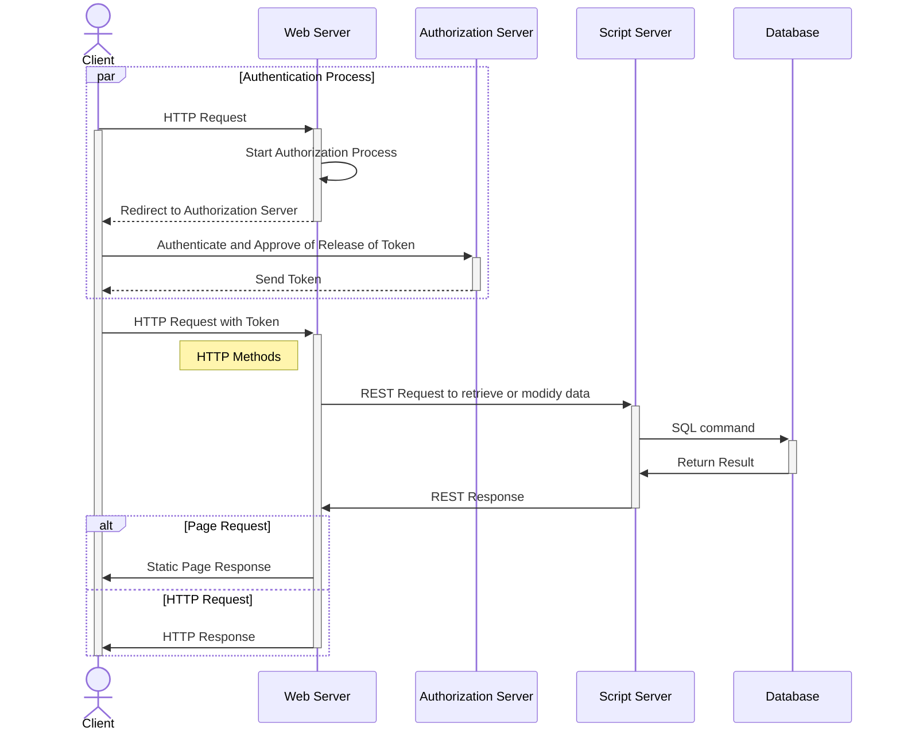

# WEBSERVER

## Setup

1. clone the source code into the machine:
`$ git clone https://github.com/jamestansx/webserver.git && cd webserver`

1. create a virtual environment:
`$ virtualenv venv`

1. activate the virtual env:%
`$ ./venv/Scripts/activate`

1. install all the dependencies:
`$ pip install -r requirements.txt`

1. start the server:
`$ waitress-server webserver:app`

## Sequence Diagram of webserver

