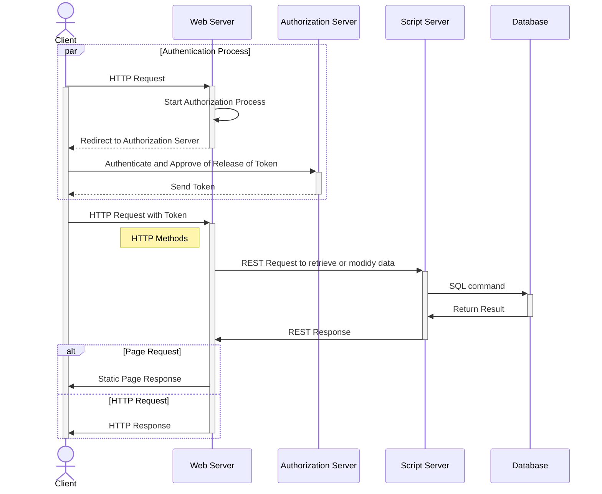

# WEBSERVER

## Sequence Diagram of webserver

```mermaid
sequenceDiagram
  actor C as Client
  participant Web as Web Server
  participant Auth as Authorization Server
  participant S as Script Server
  participant Data as Database

  par Authentication Process
    C->>+Web: HTTP Request
    activate C
    Web->>Web: Start Authorization Process
    Web-->>-C: Redirect to Authorization Server
    C->>+Auth: Authenticate and Approve of Release of Token
    Auth-->>-C: Send Token
  end
  C->>+Web: HTTP Request with Token
  note left of Web: HTTP Methods
  Web->>+S: REST Request to retrieve or modidy data
  S->>+Data: SQL command
  Data->>-S: Return Result
  S->>-Web: REST Response
    
  alt Page Request
    Web->>C: Static Page Response
  else HTTP Request
    Web->>-C: HTTP Response
  end
  deactivate C
```
