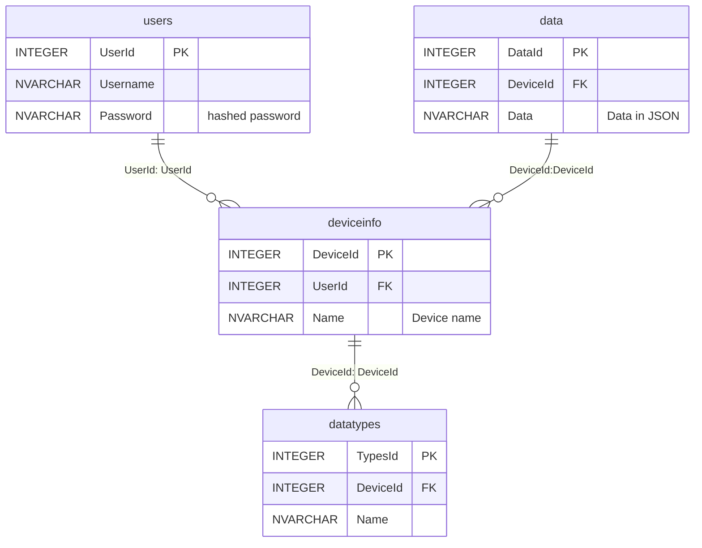

# Methodology
## web server
### dependencies

*backend*
- WSGI server: [Waitress](https://github.com/Pylons/waitress)
- WSGI library: [Werkzeug](https://wsgi.readthedocs.io/en/latest/)
- Web Framework: [Flask](https://github.com/pallets/flask)
- Database: [sqlite3](https://docs.python.org/3/library/sqlite3.html)

*frontend*
- CSS: Bootstrap

*device interconnection*
- method: REST API (refer to reference #1)
- library: Flask-RESTful

### process

*setup*

1. clone the source code into the machine:
`$ git clone https://github.com/jamestansx/webserver.git && cd webserver`

1. create a virtual environment:
`$ virtualenv venv`

1. activate the virtual env:%
`$ ./venv/Scripts/activate`

1. install all the dependencies:
`$ pip install -r requirements.txt`

*running the server*

1. start the server:
`$ waitress-server webserver:app`

### Data management

Using SQL

3 Tables:
- Users
- Device Info
- Data

Database relation diagram:

### Device Interconnection

refer to [the sequence diagram](https://github.com/jamestansx/webserver/blob/main/README.md)

